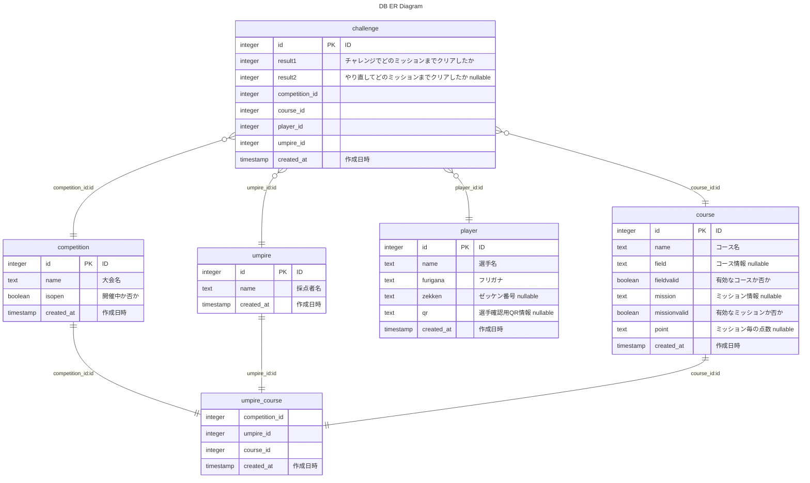

import { GithubLink } from "@site/src/components/variables.tsx"

# DB 構造

この章では DB 構造に関わる情報を記載する。
[Drizzle ORM](https://orm.drizzle.team/)という OR マッパーを使っている。
構造自体は<GithubLink filePath="app/lib/db/schema.ts" />に定義している。

また、1 から環境構築する場合は、この章の[DB 初期設定](#db-初期設定)を参照して実施する。

## ER 図



## 各テーブル詳細

各テーブルは上記 ER 図の拡大版。

### player

| data_type | column_name | key | description                   |
| --------- | ----------- | --- | ----------------------------- |
| integer   | id          | PK  | "ID"                          |
| text      | name        |     | "選手名"                      |
| text      | furigana    |     | "フリガナ"                    |
| text      | zekken      |     | "ゼッケン番号 nullable"       |
| text      | qr          |     | "選手確認用 QR 情報 nullable" |
| timestamp | created_at  |     | "作成日時"                    |

- [url]/player で新規登録・削除
- qr はチャレンジ開始時に選手の持つ QR(ゼッケンに貼るなどを想定)を読み取り、選手を特定するために使用する。(NFC タグを使うという案もある)但し、実際には未実装。
- 2024 年 11 月関東第一回では漢字選手名は入れず、フリガナとゼッケン番号だけにした。選手名漢字は無くして良いかもしれない。
- 今のところ、修正できるようにしていない。削除->新規登録で対応している。特に理由はないので、必要なら update できるようにすると良い。
- 関連ファイル
  - <GithubLink filePath="/app/api/player/route.ts" />

### course

| data_type | column_name  | key | description                   |
| --------- | ------------ | --- | ----------------------------- |
| integer   | id           | PK  | "ID"                          |
| text      | name         |     | "コース名"                    |
| text      | field        |     | "コース情報 nullable"         |
| boolean   | fieldvalid   |     | "有効なコースか否か"          |
| text      | mission      |     | "ミッション情報 nullable"     |
| boolean   | missionvalid |     | "有効なミッションか否か"      |
| text      | point        |     | "ミッション毎の点数 nullable" |
| timestamp | created_at   |     | "作成日時"                    |

- [url]/course で新規登録・削除・更新
- [url]/course/edit で編集
- field, mission, point に入るデータについては[別の章](./04-course-and-mission.mdx)で解説する。

### umpire

| data_type | column_name | key | description |
| --------- | ----------- | --- | ----------- |
| integer   | id          | PK  | "ID"        |
| text      | name        |     | "採点者名"  |
| timestamp | created_at  |     | "作成日時"  |

- [url]/umpire で新規登録・削除
- 誰が採点したか分かるようにするため機能追加しているが、実際に必要かは微妙。

### competition

| data_type | column_name | key | description    |
| --------- | ----------- | --- | -------------- |
| integer   | id          | PK  | "ID"           |
| text      | name        |     | "大会名"       |
| boolean   | isopen      |     | "開催中か否か" |
| timestamp | created_at  |     | "作成日時"     |

- [url]/config で新規登録・削除
- isopen は大会開催中か否かを表す。大会開催中はチャレンジを開始できる。大会終了後はチャレンジを開始できないようにする。未実装。

### challenge

| data_type | column_name    | key | description                                         |
| --------- | -------------- | --- | --------------------------------------------------- |
| integer   | id             | PK  | "ID"                                                |
| integer   | result1        |     | "チャレンジでどのミッションまでクリアしたか"        |
| integer   | result2        |     | "やり直してどのミッションまでクリアしたか nullable" |
| integer   | competition_id |     | "大会 ID"                                           |
| integer   | course_id      |     | "コース ID"                                         |
| integer   | player_id      |     | "選手 ID"                                           |
| integer   | umpire_id      |     | "採点者 ID"                                         |
| timestamp | created_at     |     | "作成日時"                                          |

- [url]/challenge/[competition_id]/[umpire_id]/[player_id] から結果を送信することで作成される。
- 削除、編集はアプリケーション上からはできないようにしている。
- result1, result2 には進んだミッションの数が入る。result2 はやり直しして 2 回目がある場合。result2 が null の場合、やり直しをしていない。

### umpire_course

| data_type | column_name    | key | description |
| --------- | -------------- | --- | ----------- |
| integer   | competition_id |     | "大会 ID"   |
| integer   | umpire_id      |     | "採点者 ID" |
| integer   | course_id      |     | "コース ID" |
| timestamp | created_at     |     | "作成日時"  |

- 採点者-コースが 1 対 1 になる想定で準備した table。
- 採点者を特定する必要がなければ要らない気がする。

## DB 初期設定

DB は Neon Postgres を使用している。
[Drizzle with Neon Postgres](https://orm.drizzle.team/docs/tutorials/drizzle-with-neon) に従って、DB を初期設定する。

**2 Setup connection string variable** `DATABASE_URL` は localhost の場合、`.env`に記載するが、Vercel 等に host する場合は、Vercel の環境変数に設定する。

**4 Create tables**の`schema.ts`は<GithubLink filePath="app/lib/db/schema.ts" />を使う。

正常に DB が設定できたら、ターミナル(Powershell 等)で DB に接続して、手動で THE 一本橋コースとセンサーコースを入れる。

```shell
psql "postgres://[username]:[password]@[databaseURL]:[port]/[databaseName]"
```

入れるクエリは<GithubLink filePath="app/lib/db/queries/insertIpponBashiCourse.sql" />と<GithubLink filePath="main/app/lib/db/queries/insertSensorCourse.sql" />

```sql
INSERT INTO course (id, name, field, fieldvalid, mission, missionvalid, point) VALUES (-1, 'THE IpponBashi', 'route,route,route,route,route,route,route,route,route,start', TRUE, 'u;null;mf;1;mf;1;mf;1;mf;1;mf;1;mf;1;mf;1;mf;1;mf;1;mb;1;mb;1;mb;1;mb;1;mb;1;mb;1;mb;1;mb;1;mb;1', TRUE, '0;0;1;1;1;1;1;1;1;1;1;1;1;1;1;1;1;1;1;1');
UPDATE course SET field = 'route;route;route;route;start', mission = 'u;null;mf;1;mf;1;mf;1;mf;1;tr;180;mf;1;mf;1;mf;1;mf;1', point = '0;20;1;1;1;1;0;2;2;2;2' WHERE id = -1;
INSERT INTO course (id, name, fieldvalid, missionvalid) VALUES (-2, 'SensorCourse', TRUE, TRUE);
```

上記を入れることで、THE 一本橋コースが id=-1、センサーコースが id=-2 に登録される。
