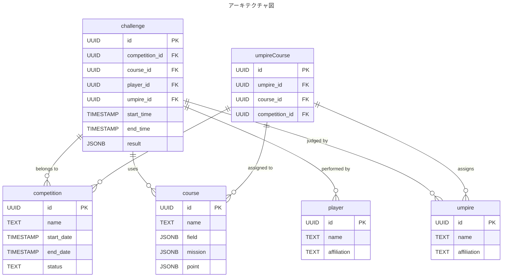

```mermaid
---
title: "アーキテクチャ図"
---

erDiagram
    competition {
        UUID id PK
        TEXT name
        TIMESTAMP start_date
        TIMESTAMP end_date
        TEXT status
    }
    course {
        UUID id PK
        TEXT name
        JSONB field
        JSONB mission
        JSONB point
    }
    player {
        UUID id PK
        TEXT name
        TEXT affiliation
    }
    umpire {
        UUID id PK
        TEXT name
        TEXT affiliation
    }
    challenge {
        UUID id PK
        UUID competition_id FK
        UUID course_id FK
        UUID player_id FK
        UUID umpire_id FK
        TIMESTAMP start_time
        TIMESTAMP end_time
        JSONB result
    }
    umpireCourse {
        UUID id PK
        UUID umpire_id FK
        UUID course_id FK
        UUID competition_id FK
    }
    challenge ||--o{ competition : "belongs to"
    challenge ||--o{ course : "uses"
    challenge ||--o{ player : "performed by"
    challenge ||--o{ umpire : "judged by"
    umpireCourse ||--o{ umpire : "assigns"
    umpireCourse ||--o{ course : "assigned to"
    umpireCourse ||--o{ competition : "part of"
```