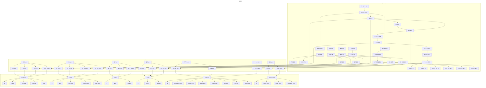

```mermaid
---
title: "ER図"
---

graph TD
    subgraph Frontend
        HomePage[ホームページ] --> ThreeTabs[3つのタブ表示]
        ThreeTabs --> ChallengeTab[採点タブ]
        ThreeTabs --> SummaryTab[集計結果タブ]
        ThreeTabs --> ManageTab[大会管理タブ]

        ChallengeTab --> SelectCompetition[大会選択]
        ChallengeTab --> SelectUmpire[審判選択]
        SelectCompetition --> SelectUmpire
        SelectUmpire --> ChallengeView[チャレンジ画面]
        ChallengeView --> SelectCourse[コース選択]
        SelectCourse --> SelectPlayer[プレイヤー選択]
        SelectPlayer --> ChallengeConfirm[確認モーダル]
        ChallengeConfirm --> ChallengeExecution[チャレンジ実行]
        ChallengeExecution --> NormalCourse[通常コース]
        ChallengeExecution --> IpponBashiCourse[一本橋コース]
        ChallengeExecution --> SensorCourse[センサーコース]

        SummaryTab --> CompetitionSummary[大会別成績表示]
        CompetitionSummary --> PlayerSummary[選手別成績表示]

        ManageTab --> ConfigView[設定画面]
        ConfigView --> CompetitionList[大会リスト]
        ConfigView --> CompetitionRegister[大会登録]
        ConfigView --> AssignList[コース審判割当]

        CourseManagement[コース管理] --> CourseList[コース一覧]
        CourseList --> CourseEdit[コース編集]
        CourseEdit --> FieldEdit[フィールド編集]
        CourseEdit --> MissionEdit[ミッション編集]
        CourseEdit --> PointEdit[ポイント編集]

        PlayerManagement[選手管理] --> PlayerList[選手一覧]
        PlayerList --> PlayerRegister[選手登録]

        UmpireManagement[審判管理] --> UmpireList[審判一覧]
        UmpireList --> UmpireRegister[審判登録]
    end

    subgraph Backend
        CompetitionAPI[大会API] --> GetCompetitions[大会一覧取得]
        CompetitionAPI --> CreateCompetition[大会作成]
        CompetitionAPI --> DeleteCompetition[大会削除]
        CompetitionAPI --> OpenCloseCompetition[大会開閉]

        CourseAPI[コースAPI] --> GetCourses[コース一覧取得]
        CourseAPI --> GetCourseById[コース詳細取得]
        CourseAPI --> CreateCourse[コース作成]
        CourseAPI --> DeleteCourse[コース削除]

        PlayerAPI[選手API] --> GetPlayers[選手一覧取得]
        PlayerAPI --> CreatePlayer[選手作成]
        PlayerAPI --> DeletePlayer[選手削除]

        UmpireAPI[審判API] --> GetUmpires[審判一覧取得]
        UmpireAPI --> CreateUmpire[審判作成]
        UmpireAPI --> DeleteUmpire[審判削除]

        AssignAPI[割当API] --> GetAssignments[割当一覧取得]
        AssignAPI --> CreateAssignment[割当作成]

        ChallengeAPI[チャレンジAPI] --> CreateChallenge[チャレンジ記録]

        SummaryAPI[サマリーAPI] --> GetSummary[成績取得]
        SummaryAPI --> GetPlayerResult[選手成績取得]
    end

    subgraph Database
        CompetitionTable[competition] --> CompetitionID[id]
        CompetitionTable --> CompetitionName[name]
        CompetitionTable --> StartDate[start_date]
        CompetitionTable --> EndDate[end_date]
        CompetitionTable --> Status[status]

        CourseTable[course] --> CourseID[id]
        CourseTable --> CourseName[name]
        CourseTable --> Field[field JSON]
        CourseTable --> Mission[mission JSON]
        CourseTable --> Point[point JSON]

        PlayerTable[player] --> PlayerID[id]
        PlayerTable --> PlayerName[name]
        PlayerTable --> PlayerAffiliation[affiliation]

        UmpireTable[umpire] --> UmpireID[id]
        UmpireTable --> UmpireName[name]
        UmpireTable --> UmpireAffiliation[affiliation]

        ChallengeTable[challenge] --> ChallengeID[id]
        ChallengeTable --> ChallengeCID[competition_id FK]
        ChallengeTable --> ChallengeCourseID[course_id FK]
        ChallengeTable --> ChallengePlayerID[player_id FK]
        ChallengeTable --> ChallengeUmpireID[umpire_id FK]
        ChallengeTable --> StartTime[start_time]
        ChallengeTable --> EndTime[end_time]
        ChallengeTable --> Result[result JSON]

        UmpireCourseTable[umpireCourse] --> UCID[id]
        UmpireCourseTable --> UCUmpireID[umpire_id FK]
        UmpireCourseTable --> UCCourseID[course_id FK]
        UmpireCourseTable --> UCCompetitionID[competition_id FK]
    end

    %% フロントエンドとバックエンドの接続
    ChallengeTab --> GetCompetitions
    ChallengeTab --> GetUmpires
    SelectUmpire --> GetAssignments
    SelectCourse --> GetCourseById
    ChallengeExecution --> CreateChallenge

    SummaryTab --> GetSummary
    PlayerSummary --> GetPlayerResult

    CompetitionList --> GetCompetitions
    CompetitionRegister --> CreateCompetition
    AssignList --> GetAssignments
    AssignList --> CreateAssignment

    CourseList --> GetCourses
    CourseEdit --> GetCourseById
    CourseEdit --> CreateCourse

    PlayerList --> GetPlayers
    PlayerRegister --> CreatePlayer

    UmpireList --> GetUmpires
    UmpireRegister --> CreateUmpire

    %% バックエンドとデータベースの接続
    GetCompetitions --> CompetitionTable
    CreateCompetition --> CompetitionTable
    DeleteCompetition --> CompetitionTable
    OpenCloseCompetition --> CompetitionTable

    GetCourses --> CourseTable
    GetCourseById --> CourseTable
    CreateCourse --> CourseTable
    DeleteCourse --> CourseTable

    GetPlayers --> PlayerTable
    CreatePlayer --> PlayerTable
    DeletePlayer --> PlayerTable

    GetUmpires --> UmpireTable
    CreateUmpire --> UmpireTable
    DeleteUmpire --> UmpireTable

    GetAssignments --> UmpireCourseTable
    CreateAssignment --> UmpireCourseTable

    CreateChallenge --> ChallengeTable

    GetSummary --> ChallengeTable
    GetPlayerResult --> ChallengeTable

```
