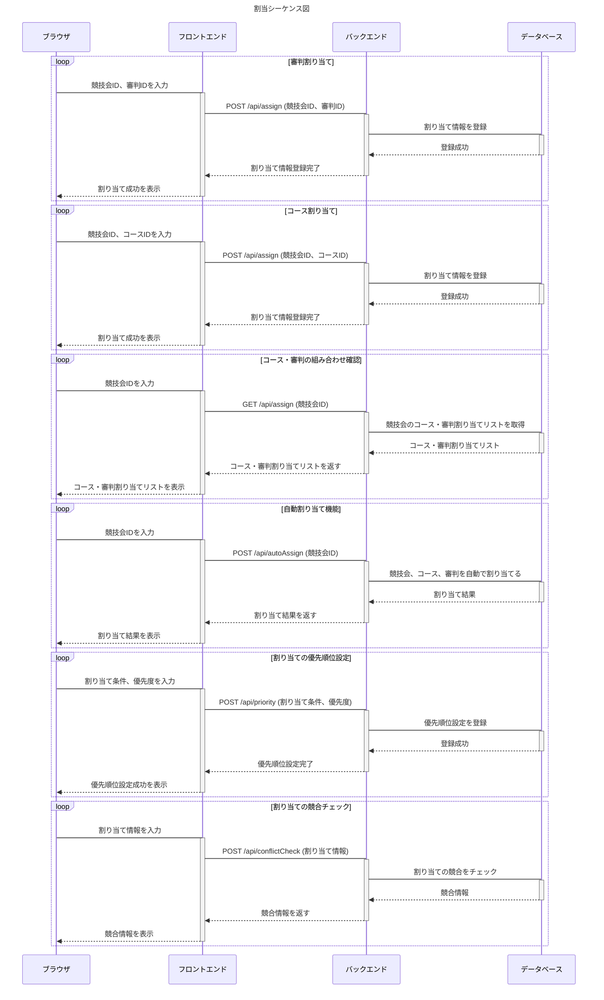

```mermaid
---
title: 割当シーケンス図
---

sequenceDiagram
    participant ブラウザ
    participant フロントエンド
    participant バックエンド
    participant データベース

    loop 審判割り当て
        ブラウザ->フロントエンド: 競技会ID、審判IDを入力
        activate フロントエンド
        フロントエンド->バックエンド: POST /api/assign (競技会ID、審判ID)
        activate バックエンド
        バックエンド->データベース: 割り当て情報を登録
        activate データベース
        データベース-->>バックエンド: 登録成功
        deactivate データベース
        バックエンド-->>フロントエンド: 割り当て情報登録完了
        deactivate バックエンド
        フロントエンド-->>ブラウザ: 割り当て成功を表示
        deactivate フロントエンド
    end

    loop コース割り当て
        ブラウザ->フロントエンド: 競技会ID、コースIDを入力
        activate フロントエンド
        フロントエンド->バックエンド: POST /api/assign (競技会ID、コースID)
        activate バックエンド
        バックエンド->データベース: 割り当て情報を登録
        activate データベース
        データベース-->>バックエンド: 登録成功
        deactivate データベース
        バックエンド-->>フロントエンド: 割り当て情報登録完了
        deactivate バックエンド
        フロントエンド-->>ブラウザ: 割り当て成功を表示
        deactivate フロントエンド
    end

    loop コース・審判の組み合わせ確認
        ブラウザ->フロントエンド: 競技会IDを入力
        activate フロントエンド
        フロントエンド->バックエンド: GET /api/assign (競技会ID)
        activate バックエンド
        バックエンド->データベース: 競技会のコース・審判割り当てリストを取得
        activate データベース
        データベース-->>バックエンド: コース・審判割り当てリスト
        deactivate データベース
        バックエンド-->>フロントエンド: コース・審判割り当てリストを返す
        deactivate バックエンド
        フロントエンド-->>ブラウザ: コース・審判割り当てリストを表示
        deactivate フロントエンド
    end

    loop 自動割り当て機能
        ブラウザ->フロントエンド: 競技会IDを入力
        activate フロントエンド
        フロントエンド->バックエンド: POST /api/autoAssign (競技会ID)
        activate バックエンド
        バックエンド->データベース: 競技会、コース、審判を自動で割り当てる
        activate データベース
        データベース-->>バックエンド: 割り当て結果
        deactivate データベース
        バックエンド-->>フロントエンド: 割り当て結果を返す
        deactivate バックエンド
        フロントエンド-->>ブラウザ: 割り当て結果を表示
        deactivate フロントエンド
    end

    loop 割り当ての優先順位設定
        ブラウザ->フロントエンド: 割り当て条件、優先度を入力
        activate フロントエンド
        フロントエンド->バックエンド: POST /api/priority (割り当て条件、優先度)
        activate バックエンド
        バックエンド->データベース: 優先順位設定を登録
        activate データベース
        データベース-->>バックエンド: 登録成功
        deactivate データベース
        バックエンド-->>フロントエンド: 優先順位設定完了
        deactivate バックエンド
        フロントエンド-->>ブラウザ: 優先順位設定成功を表示
        deactivate フロントエンド
    end

    loop 割り当ての競合チェック
        ブラウザ->フロントエンド: 割り当て情報を入力
        activate フロントエンド
        フロントエンド->バックエンド: POST /api/conflictCheck (割り当て情報)
        activate バックエンド
        バックエンド->データベース: 割り当ての競合をチェック
        activate データベース
        データベース-->>バックエンド: 競合情報
        deactivate データベース
        バックエンド-->>フロントエンド: 競合情報を返す
        deactivate バックエンド
        フロントエンド-->>ブラウザ: 競合情報を表示
        deactivate フロントエンド
    end
```
