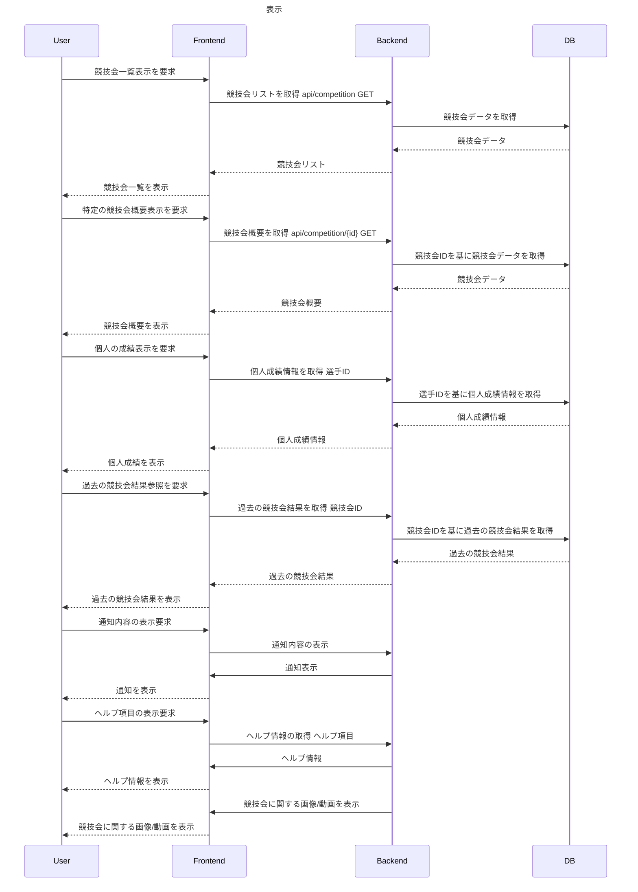

```mermaid
---
title: 表示
---
sequenceDiagram
  participant User
  participant Frontend
  participant Backend
  participant DB

  User->>Frontend: 競技会一覧表示を要求
  Frontend->>Backend: 競技会リストを取得 api/competition GET
  Backend->>DB: 競技会データを取得
  DB-->>Backend: 競技会データ
  Backend-->>Frontend: 競技会リスト
  Frontend-->>User: 競技会一覧を表示

  User->>Frontend: 特定の競技会概要表示を要求
  Frontend->>Backend: 競技会概要を取得 api/competition/{id} GET
  Backend->>DB: 競技会IDを基に競技会データを取得
  DB-->>Backend: 競技会データ
  Backend-->>Frontend: 競技会概要
  Frontend-->>User: 競技会概要を表示

  User->>Frontend: 個人の成績表示を要求
  Frontend->>Backend: 個人成績情報を取得 選手ID
  Backend->>DB: 選手IDを基に個人成績情報を取得
  DB-->>Backend: 個人成績情報
  Backend-->>Frontend: 個人成績情報
  Frontend-->>User: 個人成績を表示

  User->>Frontend: 過去の競技会結果参照を要求
  Frontend->>Backend: 過去の競技会結果を取得 競技会ID
  Backend->>DB: 競技会IDを基に過去の競技会結果を取得
  DB-->>Backend: 過去の競技会結果
  Backend-->>Frontend: 過去の競技会結果
  Frontend-->>User: 過去の競技会結果を表示

  User->>Frontend: 通知内容の表示要求
  Frontend->>Backend: 通知内容の表示
  Backend->>Frontend: 通知表示
  Frontend-->>User: 通知を表示

  User->>Frontend: ヘルプ項目の表示要求
  Frontend->>Backend: ヘルプ情報の取得 ヘルプ項目
  Backend->>Frontend: ヘルプ情報
  Frontend-->>User: ヘルプ情報を表示

  Backend->>Frontend: 競技会に関する画像/動画を表示
  Frontend-->>User: 競技会に関する画像/動画を表示
```
