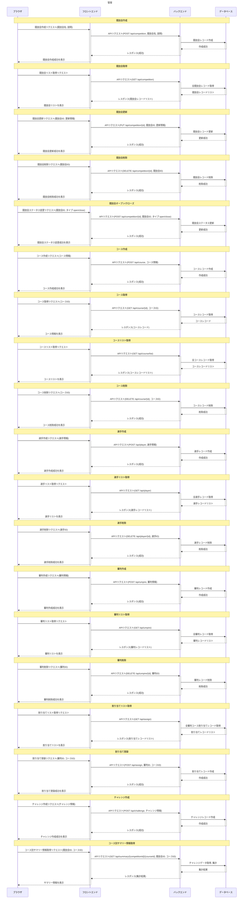

```mermaid
---
title: 管理
---
sequenceDiagram
    participant ブラウザ
    participant フロントエンド
    participant バックエンド
    participant データベース

    Note over ブラウザ, データベース: 競技会作成
    ブラウザ->>フロントエンド: 競技会作成リクエスト(競技会名, 説明)
    activate フロントエンド
    フロントエンド->>バックエンド: APIリクエスト(POST /api/competition, 競技会名, 説明)
    activate バックエンド
    バックエンド->>データベース: 競技会レコード作成
    activate データベース
    データベース-->>バックエンド: 作成成功
    deactivate データベース
    バックエンド-->>フロントエンド: レスポンス(成功)
    deactivate バックエンド
    フロントエンド-->>ブラウザ: 競技会作成成功を表示
    deactivate フロントエンド

    Note over ブラウザ, データベース: 競技会取得
    ブラウザ->>フロントエンド: 競技会リスト取得リクエスト
    activate フロントエンド
    フロントエンド->>バックエンド: APIリクエスト(GET /api/competition)
    activate バックエンド
    バックエンド->>データベース: 全競技会レコード取得
    activate データベース
    データベース-->>バックエンド: 競技会レコードリスト
    deactivate データベース
    バックエンド-->>フロントエンド: レスポンス(競技会レコードリスト)
    deactivate バックエンド
    フロントエンド-->>ブラウザ: 競技会リストを表示
    deactivate フロントエンド

    Note over ブラウザ, データベース: 競技会更新
    ブラウザ->>フロントエンド: 競技会更新リクエスト(競技会ID, 更新情報)
    activate フロントエンド
    フロントエンド->>バックエンド: APIリクエスト(PUT /api/competition/{id}, 競技会ID, 更新情報)
    activate バックエンド
    バックエンド->>データベース: 競技会レコード更新
    activate データベース
    データベース-->>バックエンド: 更新成功
    deactivate データベース
    バックエンド-->>フロントエンド: レスポンス(成功)
    deactivate バックエンド
    フロントエンド-->>ブラウザ: 競技会更新成功を表示
    deactivate フロントエンド

    Note over ブラウザ, データベース: 競技会削除
    ブラウザ->>フロントエンド: 競技会削除リクエスト(競技会ID)
    activate フロントエンド
    フロントエンド->>バックエンド: APIリクエスト(DELETE /api/competition/{id}, 競技会ID)
    activate バックエンド
    バックエンド->>データベース: 競技会レコード削除
    activate データベース
    データベース-->>バックエンド: 削除成功
    deactivate データベース
    バックエンド-->>フロントエンド: レスポンス(成功)
    deactivate バックエンド
    フロントエンド-->>ブラウザ: 競技会削除成功を表示
    deactivate フロントエンド

    Note over ブラウザ, データベース: 競技会オープン/クローズ
    ブラウザ->>フロントエンド: 競技会ステータス変更リクエスト(競技会ID, タイプ open/close)
    activate フロントエンド
    フロントエンド->>バックエンド: APIリクエスト(POST /api/competition/{id}, 競技会ID, タイプ open/close)
    activate バックエンド
    バックエンド->>データベース: 競技会ステータス更新
    activate データベース
    データベース-->>バックエンド: 更新成功
    deactivate データベース
    バックエンド-->>フロントエンド: レスポンス(成功)
    deactivate バックエンド
    フロントエンド-->>ブラウザ: 競技会ステータス変更成功を表示
    deactivate フロントエンド


    Note over ブラウザ, データベース: コース作成
    ブラウザ->>フロントエンド: コース作成リクエスト(コース情報)
    activate フロントエンド
    フロントエンド->>バックエンド: APIリクエスト(POST /api/course, コース情報)
    activate バックエンド
    バックエンド->>データベース: コースレコード作成
    activate データベース
    データベース-->>バックエンド: 作成成功
    deactivate データベース
    バックエンド-->>フロントエンド: レスポンス(成功)
    deactivate バックエンド
    フロントエンド-->>ブラウザ: コース作成成功を表示
    deactivate フロントエンド

    Note over ブラウザ, データベース: コース取得
    ブラウザ->>フロントエンド: コース取得リクエスト(コースID)
    activate フロントエンド
    フロントエンド->>バックエンド: APIリクエスト(GET /api/course/{id}, コースID)
    activate バックエンド
    バックエンド->>データベース: コースレコード取得
    activate データベース
    データベース-->>バックエンド: コースレコード
    deactivate データベース
    バックエンド-->>フロントエンド: レスポンス(コースレコード)
    deactivate バックエンド
    フロントエンド-->>ブラウザ: コース情報を表示
    deactivate フロントエンド

    Note over ブラウザ, データベース: コースリスト取得
    ブラウザ->>フロントエンド: コースリスト取得リクエスト
    activate フロントエンド
    フロントエンド->>バックエンド: APIリクエスト(GET /api/course/list)
    activate バックエンド
    バックエンド->>データベース: 全コースレコード取得
    activate データベース
    データベース-->>バックエンド: コースレコードリスト
    deactivate データベース
    バックエンド-->>フロントエンド: レスポンス(コースレコードリスト)
    deactivate バックエンド
    フロントエンド-->>ブラウザ: コースリストを表示
    deactivate フロントエンド

    Note over ブラウザ, データベース: コース削除
    ブラウザ->>フロントエンド: コース削除リクエスト(コースID)
    activate フロントエンド
    フロントエンド->>バックエンド: APIリクエスト(DELETE /api/course/{id}, コースID)
    activate バックエンド
    バックエンド->>データベース: コースレコード削除
    activate データベース
    データベース-->>バックエンド: 削除成功
    deactivate データベース
    バックエンド-->>フロントエンド: レスポンス(成功)
    deactivate バックエンド
    フロントエンド-->>ブラウザ: コース削除成功を表示
    deactivate フロントエンド

    Note over ブラウザ, データベース: 選手作成
    ブラウザ->>フロントエンド: 選手作成リクエスト(選手情報)
    activate フロントエンド
    フロントエンド->>バックエンド: APIリクエスト(POST /api/player, 選手情報)
    activate バックエンド
    バックエンド->>データベース: 選手レコード作成
    activate データベース
    データベース-->>バックエンド: 作成成功
    deactivate データベース
    バックエンド-->>フロントエンド: レスポンス(成功)
    deactivate バックエンド
    フロントエンド-->>ブラウザ: 選手作成成功を表示
    deactivate フロントエンド

    Note over ブラウザ, データベース: 選手リスト取得
    ブラウザ->>フロントエンド: 選手リスト取得リクエスト
    activate フロントエンド
    フロントエンド->>バックエンド: APIリクエスト(GET /api/player)
    activate バックエンド
    バックエンド->>データベース: 全選手レコード取得
    activate データベース
    データベース-->>バックエンド: 選手レコードリスト
    deactivate データベース
    バックエンド-->>フロントエンド: レスポンス(選手レコードリスト)
    deactivate バックエンド
    フロントエンド-->>ブラウザ: 選手リストを表示
    deactivate フロントエンド

    Note over ブラウザ, データベース: 選手削除
    ブラウザ->>フロントエンド: 選手削除リクエスト(選手ID)
    activate フロントエンド
    フロントエンド->>バックエンド: APIリクエスト(DELETE /api/player/{id}, 選手ID)
    activate バックエンド
    バックエンド->>データベース: 選手レコード削除
    activate データベース
    データベース-->>バックエンド: 削除成功
    deactivate データベース
    バックエンド-->>フロントエンド: レスポンス(成功)
    deactivate バックエンド
    フロントエンド-->>ブラウザ: 選手削除成功を表示
    deactivate フロントエンド

    Note over ブラウザ, データベース: 審判作成
    ブラウザ->>フロントエンド: 審判作成リクエスト(審判情報)
    activate フロントエンド
    フロントエンド->>バックエンド: APIリクエスト(POST /api/umpire, 審判情報)
    activate バックエンド
    バックエンド->>データベース: 審判レコード作成
    activate データベース
    データベース-->>バックエンド: 作成成功
    deactivate データベース
    バックエンド-->>フロントエンド: レスポンス(成功)
    deactivate バックエンド
    フロントエンド-->>ブラウザ: 審判作成成功を表示
    deactivate フロントエンド

    Note over ブラウザ, データベース: 審判リスト取得
    ブラウザ->>フロントエンド: 審判リスト取得リクエスト
    activate フロントエンド
    フロントエンド->>バックエンド: APIリクエスト(GET /api/umpire)
    activate バックエンド
    バックエンド->>データベース: 全審判レコード取得
    activate データベース
    データベース-->>バックエンド: 審判レコードリスト
    deactivate データベース
    バックエンド-->>フロントエンド: レスポンス(審判レコードリスト)
    deactivate バックエンド
    フロントエンド-->>ブラウザ: 審判リストを表示
    deactivate フロントエンド

    Note over ブラウザ, データベース: 審判削除
    ブラウザ->>フロントエンド: 審判削除リクエスト(審判ID)
    activate フロントエンド
    フロントエンド->>バックエンド: APIリクエスト(DELETE /api/umpire/{id}, 審判ID)
    activate バックエンド
    バックエンド->>データベース: 審判レコード削除
    activate データベース
    データベース-->>バックエンド: 削除成功
    deactivate データベース
    バックエンド-->>フロントエンド: レスポンス(成功)
    deactivate バックエンド
    フロントエンド-->>ブラウザ: 審判削除成功を表示
    deactivate フロントエンド

    Note over ブラウザ, データベース: 割り当てリスト取得
    ブラウザ->>フロントエンド: 割り当てリスト取得リクエスト
    activate フロントエンド
    フロントエンド->>バックエンド: APIリクエスト(GET /api/assign)
    activate バックエンド
    バックエンド->>データベース: 全審判コース割り当てレコード取得
    activate データベース
    データベース-->>バックエンド: 割り当てレコードリスト
    deactivate データベース
    バックエンド-->>フロントエンド: レスポンス(割り当てレコードリスト)
    deactivate バックエンド
    フロントエンド-->>ブラウザ: 割り当てリストを表示
    deactivate フロントエンド

    Note over ブラウザ, データベース: 割り当て登録
    ブラウザ->>フロントエンド: 割り当て登録リクエスト(審判ID, コースID)
    activate フロントエンド
    フロントエンド->>バックエンド: APIリクエスト(POST /api/assign, 審判ID, コースID)
    activate バックエンド
    バックエンド->>データベース: 割り当てレコード作成
    activate データベース
    データベース-->>バックエンド: 作成成功
    deactivate データベース
    バックエンド-->>フロントエンド: レスポンス(成功)
    deactivate バックエンド
    フロントエンド-->>ブラウザ: 割り当て登録成功を表示
    deactivate フロントエンド

    Note over ブラウザ, データベース: チャレンジ作成
    ブラウザ->>フロントエンド: チャレンジ作成リクエスト(チャレンジ情報)
    activate フロントエンド
    フロントエンド->>バックエンド: APIリクエスト(POST /api/challenge, チャレンジ情報)
    activate バックエンド
    バックエンド->>データベース: チャレンジレコード作成
    activate データベース
    データベース-->>バックエンド: 作成成功
    deactivate データベース
    バックエンド-->>フロントエンド: レスポンス(成功)
    deactivate バックエンド
    フロントエンド-->>ブラウザ: チャレンジ作成成功を表示
    deactivate フロントエンド

    Note over ブラウザ, データベース: コース別サマリー情報取得
    ブラウザ->>フロントエンド: コース別サマリー情報取得リクエスト(競技会ID, コースID)
    activate フロントエンド
    フロントエンド->>バックエンド: APIリクエスト(GET /api/summary/{competitionId}/{courseId}, 競技会ID, コースID)
    activate バックエンド
    バックエンド->>データベース: チャレンジデータ取得, 集計
    activate データベース
    データベース-->>バックエンド: 集計結果
    deactivate データベース
    バックエンド-->>フロントエンド: レスポンス(集計結果)
    deactivate バックエンド
    フロントエンド-->>ブラウザ: サマリー情報を表示
    deactivate フロントエンド
```
