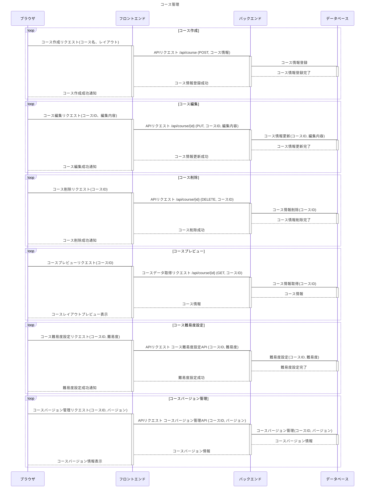

```mermaid
---
title: コース管理
---
sequenceDiagram
    participant ブラウザ
    participant フロントエンド
    participant バックエンド
    participant データベース

    loop コース作成
        ブラウザ->フロントエンド: コース作成リクエスト(コース名、レイアウト)
        activate フロントエンド
        フロントエンド->バックエンド: APIリクエスト /api/course (POST, コース情報)
        activate バックエンド
        バックエンド->データベース: コース情報登録
        activate データベース
        データベース-->バックエンド: コース情報登録完了
        deactivate データベース
        バックエンド-->フロントエンド: コース情報登録成功
        deactivate バックエンド
        フロントエンド-->ブラウザ: コース作成成功通知
        deactivate フロントエンド
    end

    loop コース編集
        ブラウザ->フロントエンド: コース編集リクエスト(コースID、編集内容)
        activate フロントエンド
        フロントエンド->バックエンド: APIリクエスト /api/course/{id} (PUT, コースID, 編集内容)
        activate バックエンド
        バックエンド->データベース: コース情報更新(コースID, 編集内容)
        activate データベース
        データベース-->バックエンド: コース情報更新完了
        deactivate データベース
        バックエンド-->フロントエンド: コース情報更新成功
        deactivate バックエンド
        フロントエンド-->ブラウザ: コース編集成功通知
        deactivate フロントエンド
    end

    loop コース削除
        ブラウザ->フロントエンド: コース削除リクエスト(コースID)
        activate フロントエンド
        フロントエンド->バックエンド: APIリクエスト /api/course/{id} (DELETE, コースID)
        activate バックエンド
        バックエンド->データベース: コース情報削除(コースID)
        activate データベース
        データベース-->バックエンド: コース情報削除完了
        deactivate データベース
        バックエンド-->フロントエンド: コース削除成功
        deactivate バックエンド
        フロントエンド-->ブラウザ: コース削除成功通知
        deactivate フロントエンド
    end

    loop コースプレビュー
        ブラウザ->フロントエンド: コースプレビューリクエスト(コースID)
        activate フロントエンド
        フロントエンド->バックエンド: コースデータ取得リクエスト /api/course/{id} (GET, コースID)
        activate バックエンド
        バックエンド->データベース: コース情報取得(コースID)
        activate データベース
        データベース-->バックエンド: コース情報
        deactivate データベース
        バックエンド-->フロントエンド: コース情報
        deactivate バックエンド
        フロントエンド-->ブラウザ: コースレイアウトプレビュー表示
        deactivate フロントエンド
    end

    loop コース難易度設定
        ブラウザ->フロントエンド: コース難易度設定リクエスト(コースID, 難易度)
        activate フロントエンド
        フロントエンド->バックエンド: APIリクエスト コース難易度設定API (コースID, 難易度)
        activate バックエンド
        バックエンド->データベース: 難易度設定(コースID, 難易度)
        activate データベース
        データベース-->バックエンド: 難易度設定完了
        deactivate データベース
        バックエンド-->フロントエンド: 難易度設定成功
        deactivate バックエンド
        フロントエンド-->ブラウザ: 難易度設定成功通知
        deactivate フロントエンド
    end

    loop コースバージョン管理
        ブラウザ->フロントエンド: コースバージョン管理リクエスト(コースID, バージョン)
        activate フロントエンド
        フロントエンド->バックエンド: APIリクエスト コースバージョン管理API (コースID, バージョン)
        activate バックエンド
        バックエンド->データベース: コースバージョン管理(コースID, バージョン)
        activate データベース
        データベース-->バックエンド: コースバージョン情報
        deactivate データベース
        バックエンド-->フロントエンド: コースバージョン情報
        deactivate バックエンド
        フロントエンド-->ブラウザ: コースバージョン情報表示
        deactivate フロントエンド
    end
```
