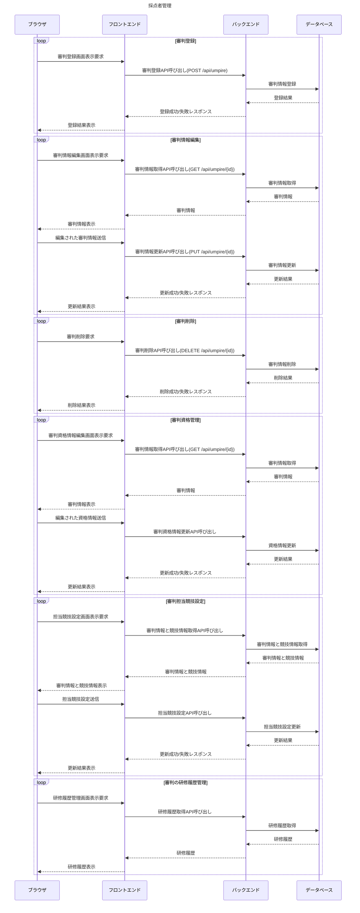

```mermaid
---
title: 採点者管理
---
sequenceDiagram
    participant ブラウザ
    participant フロントエンド
    participant バックエンド
    participant データベース

    loop 審判登録
        ブラウザ->>フロントエンド: 審判登録画面表示要求
        フロントエンド->>バックエンド: 審判登録API呼び出し(POST /api/umpire)
        バックエンド->>データベース: 審判情報登録
        データベース-->>バックエンド: 登録結果
        バックエンド-->>フロントエンド: 登録成功/失敗レスポンス
        フロントエンド-->>ブラウザ: 登録結果表示
    end

    loop 審判情報編集
        ブラウザ->>フロントエンド: 審判情報編集画面表示要求
        フロントエンド->>バックエンド: 審判情報取得API呼び出し(GET /api/umpire/{id})
        バックエンド->>データベース: 審判情報取得
        データベース-->>バックエンド: 審判情報
        バックエンド-->>フロントエンド: 審判情報
        フロントエンド-->>ブラウザ: 審判情報表示

        ブラウザ->>フロントエンド: 編集された審判情報送信
        フロントエンド->>バックエンド: 審判情報更新API呼び出し(PUT /api/umpire/{id})
        バックエンド->>データベース: 審判情報更新
        データベース-->>バックエンド: 更新結果
        バックエンド-->>フロントエンド: 更新成功/失敗レスポンス
        フロントエンド-->>ブラウザ: 更新結果表示
    end

    loop 審判削除
        ブラウザ->>フロントエンド: 審判削除要求
        フロントエンド->>バックエンド: 審判削除API呼び出し(DELETE /api/umpire/{id})
        バックエンド->>データベース: 審判情報削除
        データベース-->>バックエンド: 削除結果
        バックエンド-->>フロントエンド: 削除成功/失敗レスポンス
        フロントエンド-->>ブラウザ: 削除結果表示
    end

    loop 審判資格管理
        ブラウザ->>フロントエンド: 審判資格情報編集画面表示要求
        フロントエンド->>バックエンド: 審判情報取得API呼び出し(GET /api/umpire/{id})
        バックエンド->>データベース: 審判情報取得
        データベース-->>バックエンド: 審判情報
        バックエンド-->>フロントエンド: 審判情報
        フロントエンド-->>ブラウザ: 審判情報表示

        ブラウザ->>フロントエンド: 編集された資格情報送信
        フロントエンド->>バックエンド: 審判資格情報更新API呼び出し
        バックエンド->>データベース: 資格情報更新
        データベース-->>バックエンド: 更新結果
        バックエンド-->>フロントエンド: 更新成功/失敗レスポンス
        フロントエンド-->>ブラウザ: 更新結果表示
    end

    loop 審判担当競技設定
        ブラウザ->>フロントエンド: 担当競技設定画面表示要求
        フロントエンド->>バックエンド: 審判情報と競技情報取得API呼び出し
        バックエンド->>データベース: 審判情報と競技情報取得
        データベース-->>バックエンド: 審判情報と競技情報
        バックエンド-->>フロントエンド: 審判情報と競技情報
        フロントエンド-->>ブラウザ: 審判情報と競技情報表示

        ブラウザ->>フロントエンド: 担当競技設定送信
        フロントエンド->>バックエンド: 担当競技設定API呼び出し
        バックエンド->>データベース: 担当競技設定更新
        データベース-->>バックエンド: 更新結果
        バックエンド-->>フロントエンド: 更新成功/失敗レスポンス
        フロントエンド-->>ブラウザ: 更新結果表示
    end

    loop 審判の研修履歴管理
        ブラウザ->>フロントエンド: 研修履歴管理画面表示要求
        フロントエンド->>バックエンド: 研修履歴取得API呼び出し
        バックエンド->>データベース: 研修履歴取得
        データベース-->>バックエンド: 研修履歴
        バックエンド-->>フロントエンド: 研修履歴
        フロントエンド-->>ブラウザ: 研修履歴表示
    end
```
