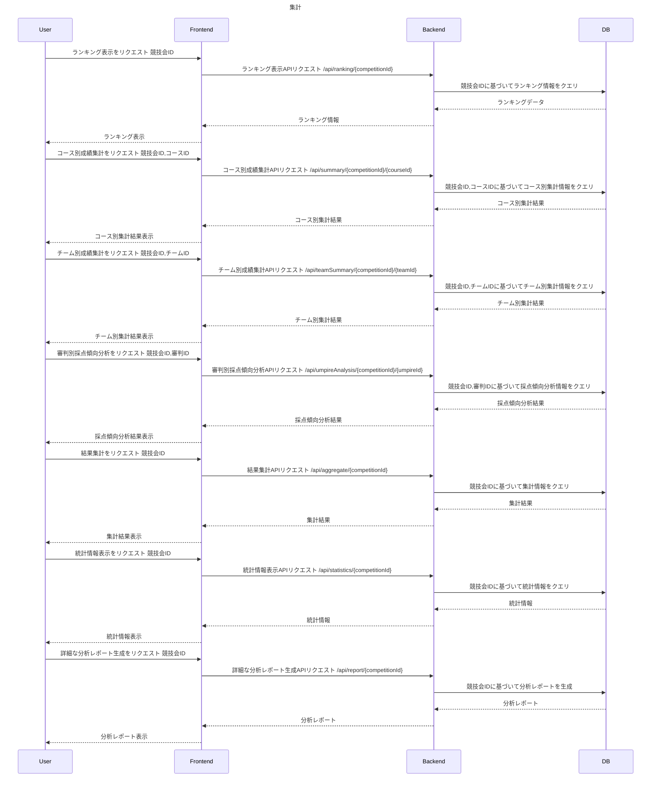

```mermaid
---
title: 集計
---
sequenceDiagram
    participant User
    participant Frontend
    participant Backend
    participant DB

    User->>Frontend: ランキング表示をリクエスト 競技会ID
    Frontend->>Backend: ランキング表示APIリクエスト /api/ranking/{competitionId}
    Backend->>DB: 競技会IDに基づいてランキング情報をクエリ
    DB-->>Backend: ランキングデータ
    Backend-->>Frontend: ランキング情報
    Frontend-->>User: ランキング表示

    User->>Frontend: コース別成績集計をリクエスト 競技会ID,コースID
    Frontend->>Backend: コース別成績集計APIリクエスト /api/summary/{competitionId}/{courseId}
    Backend->>DB: 競技会ID,コースIDに基づいてコース別集計情報をクエリ
    DB-->>Backend: コース別集計結果
    Backend-->>Frontend: コース別集計結果
    Frontend-->>User: コース別集計結果表示

    User->>Frontend: チーム別成績集計をリクエスト 競技会ID,チームID
    Frontend->>Backend: チーム別成績集計APIリクエスト /api/teamSummary/{competitionId}/{teamId}
    Backend->>DB: 競技会ID,チームIDに基づいてチーム別集計情報をクエリ
    DB-->>Backend: チーム別集計結果
    Backend-->>Frontend: チーム別集計結果
    Frontend-->>User: チーム別集計結果表示

    User->>Frontend: 審判別採点傾向分析をリクエスト 競技会ID,審判ID
    Frontend->>Backend: 審判別採点傾向分析APIリクエスト /api/umpireAnalysis/{competitionId}/{umpireId}
    Backend->>DB: 競技会ID,審判IDに基づいて採点傾向分析情報をクエリ
    DB-->>Backend: 採点傾向分析結果
    Backend-->>Frontend: 採点傾向分析結果
    Frontend-->>User: 採点傾向分析結果表示

    User->>Frontend: 結果集計をリクエスト 競技会ID
    Frontend->>Backend: 結果集計APIリクエスト /api/aggregate/{competitionId}
    Backend->>DB: 競技会IDに基づいて集計情報をクエリ
    DB-->>Backend: 集計結果
    Backend-->>Frontend: 集計結果
    Frontend-->>User: 集計結果表示

    User->>Frontend: 統計情報表示をリクエスト 競技会ID
    Frontend->>Backend: 統計情報表示APIリクエスト /api/statistics/{competitionId}
    Backend->>DB: 競技会IDに基づいて統計情報をクエリ
    DB-->>Backend: 統計情報
    Backend-->>Frontend: 統計情報
    Frontend-->>User: 統計情報表示

    User->>Frontend: 詳細な分析レポート生成をリクエスト 競技会ID
    Frontend->>Backend: 詳細な分析レポート生成APIリクエスト /api/report/{competitionId}
    Backend->>DB: 競技会IDに基づいて分析レポートを生成
    DB-->>Backend: 分析レポート
    Backend-->>Frontend: 分析レポート
    Frontend-->>User: 分析レポート表示
```
